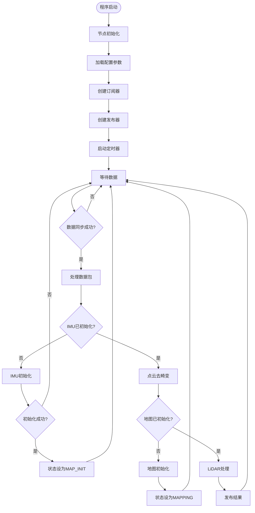
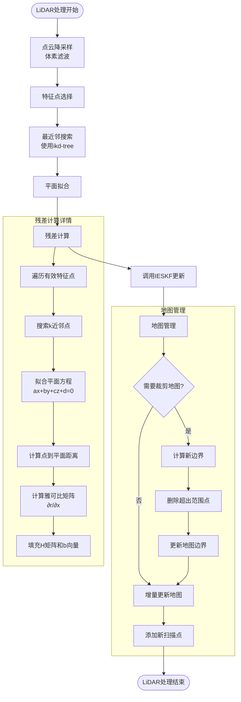
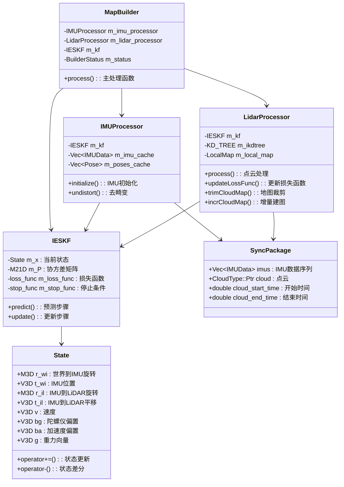
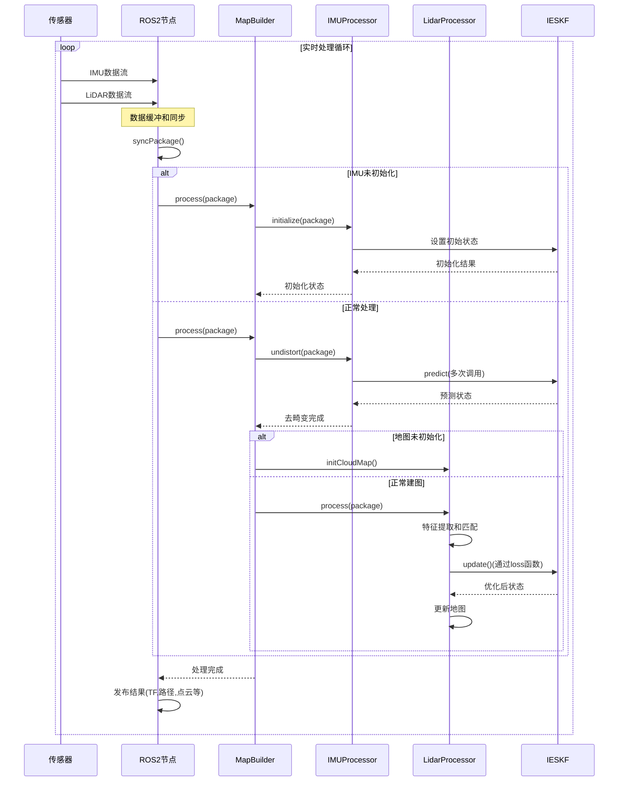

# FastLIO2 程序数据流程图和架构图

## 1. 系统整体架构图

```mermaid
graph TD
    A[传感器输入层] --> B[数据同步层]
    B --> C[算法处理层]
    C --> D[结果输出层]
    
    subgraph "传感器输入层"
        A1[IMU传感器<br/>• 角速度<br/>• 线加速度<br/>• 时间戳]
        A2[LiDAR传感器<br/>• 点云数据<br/>• 强度信息<br/>• 时间戳]
    end
    
    subgraph "数据同步层"
        B1[IMU回调函数<br/>imuCB()]
        B2[LiDAR回调函数<br/>livoxCB()/lidarCB()]
        B3[数据同步器<br/>syncPackage()]
        B1 --> B3
        B2 --> B3
    end
    
    subgraph "算法处理层"
        C1[MapBuilder<br/>总控制器]
        C2[IMUProcessor<br/>IMU处理]
        C3[LidarProcessor<br/>点云处理]
        C4[IESKF<br/>状态估计器]
        C1 --> C2
        C1 --> C3
        C2 --> C4
        C3 --> C4
    end
    
    subgraph "结果输出层"
        D1[TF变换发布<br/>坐标系关系]
        D2[路径发布<br/>机器人轨迹]
        D3[点云发布<br/>实时地图]
        D4[里程计发布<br/>位姿速度]
    end
    
    A1 --> B1
    A2 --> B2
    C --> D1
    C --> D2
    C --> D3
    C --> D4
```

## 2. 主程序执行流程



## 3. IESKF状态估计详细流程

```mermaid
flowchart TD
    Start([IESKF开始]) --> Predict[预测步骤]
    
    subgraph "预测步骤 predict()"
        Predict --> P1[状态传播<br/>姿态: r_wi *= exp(ω*dt)<br/>位置: t_wi += v*dt<br/>速度: v += (R*(a-ba)+g)*dt]
        P1 --> P2[雅可比计算<br/>状态转移矩阵F<br/>噪声矩阵G]
        P2 --> P3[协方差传播<br/>P = F*P*F^T + G*Q*G^T]
    end
    
    P3 --> Update[更新步骤]
    
    subgraph "更新步骤 update()"
        Update --> U1[保存预测状态<br/>predict_x = x]
        U1 --> IterStart[开始迭代 i=0]
        IterStart --> U2[计算观测<br/>调用损失函数]
        U2 --> U3{观测有效?}
        U3 -->|否| IterEnd
        U3 -->|是| U4[构建信息矩阵<br/>H = J^T*P^-1*J + H_obs<br/>b = J^T*P^-1*δx + b_obs]
        U4 --> U5[求解增量<br/>δx = -H^-1*b]
        U5 --> U6[状态更新<br/>x += δx]
        U6 --> U7[迭代计数<br/>i++]
        U7 --> U8{收敛检查}
        U8 -->|未收敛| U2
        U8 -->|收敛| U9[更新协方差<br/>P = L*H^-1*L^T]
    end
    
    U9 --> IterEnd([IESKF结束])
```

## 4. IMU处理流程

```mermaid
flowchart TD
    IMUStart([IMU处理开始]) --> InitCheck{需要初始化?}
    
    subgraph "IMU初始化 initialize()"
        InitCheck -->|是| I1[积累IMU数据]
        I1 --> I2{数据量足够?}
        I2 -->|否| I3[等待更多数据]
        I3 --> I1
        I2 -->|是| I4[计算平均值<br/>acc_mean, gyro_mean]
        I4 --> I5[设置初始偏置<br/>bg = gyro_mean]
        I5 --> I6[重力对齐处理<br/>估计重力方向]
        I6 --> I7[初始化协方差矩阵]
        I7 --> InitDone[初始化完成]
    end
    
    InitCheck -->|否| Undist[点云去畸变]
    InitDone --> ProcessEnd
    
    subgraph "点云去畸变 undistort()"
        Undist --> U1[准备IMU缓存<br/>添加前一帧最后IMU]
        U1 --> U2[初始化姿态缓存<br/>记录t=0时刻状态]
        U2 --> U3[IMU预积分循环]
        
        subgraph "预积分处理"
            U3 --> U4[计算中值<br/>gyro = 0.5*(head+tail)<br/>acc = 0.5*(head+tail)]
            U4 --> U5[调用IESKF预测<br/>更新状态和协方差]
            U5 --> U6[记录当前姿态<br/>存储到poses_cache]
            U6 --> U7{还有IMU数据?}
            U7 -->|是| U4
        end
        
        U7 -->|否| U8[外推到扫描结束]
        U8 --> U9[点云运动补偿]
        
        subgraph "运动补偿"
            U9 --> U10[遍历所有点]
            U10 --> U11[根据时间戳插值姿态]
            U11 --> U12[计算补偿变换<br/>将点变换到扫描结束时刻]
            U12 --> U13{处理完所有点?}
            U13 -->|否| U10
        end
    end
    
    U13 -->|是| ProcessEnd([IMU处理结束])
```

## 5. LiDAR处理流程



## 6. 数据结构关系图



## 7. 时间序列处理流程



这些图表详细展示了FastLIO2系统的完整架构和数据流程，从传感器数据输入到最终结果输出的每个步骤都有清晰的说明。